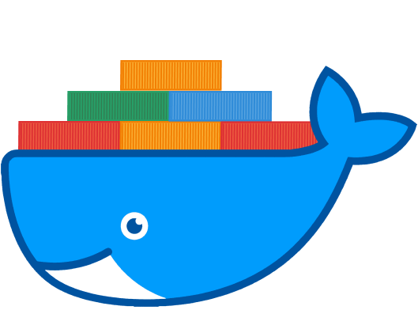

## Introduction

In recent years, containerization has become an integral part of software engineering practices. Docker, a popular containerization platform, has gained significant attention due to its ease of use and efficiency. This summary provides an overview of the key concepts, advantages, challenges, and purpose of containerizing software applications using Docker.

## Idea: Containerizing the CI/CD Pipeline

One possible application of Docker in software engineering is containerizing the continuous integration and continuous deployment (CI/CD) pipeline. By using Docker containers to encapsulate various stages of the pipeline, developers can achieve consistent and reproducible builds, tests, and deployments.

For example, the build stage can be containerized, ensuring that the code is built in an environment with the exact dependencies specified in the Docker image. This eliminates any inconsistencies that may arise from differences in development environments and guarantees that the build process is repeatable.

Similarly, the test stage can be containerized, allowing developers to run tests in a controlled and isolated environment. Test containers can be configured with specific dependencies and configurations to simulate different deployment environments, ensuring comprehensive test coverage.

Finally, the deployment stage can also benefit from containerization. Docker containers can be used to package the application along with its dependencies, making it easier to deploy the application across different environments. With container orchestration platforms like Kubernetes, the deployment process can be automated and scaled based on demand.

By containerizing the CI/CD pipeline, software engineering teams can achieve greater efficiency, consistency, and scalability in their software development and deployment processes.

## What is Docker?

Docker is an open-source platform that enables developers to automate the deployment and management of applications within lightweight, isolated containers. Containers provide a consistent and reproducible environment, allowing developers to package an application and its dependencies into a single unit.

## Containerization Benefits

Containerization offers several advantages in software engineering:

### Portability

Containers encapsulate the entire runtime environment, including the application and its dependencies. This portability allows developers to run the application consistently across different environments, such as development, testing, and production. It eliminates the "it works on my machine" problem and reduces deployment-related issues.

### Isolation

Containers provide process-level isolation, ensuring that each application runs in its own isolated environment. This isolation prevents conflicts between applications and allows for better resource utilization. Additionally, it enhances security by limiting the impact of potential vulnerabilities.

### Scalability

Containers enable horizontal scalability by allowing developers to easily spin up multiple instances of an application. With container orchestration platforms like Kubernetes, applications can scale up or down dynamically based on demand. This flexibility ensures optimal resource allocation and improves overall system performance.

## Docker Architecture

Docker follows a client-server architecture, comprising three main components:

### Docker Engine

The Docker Engine is the core component responsible for building, running, and managing containers. It consists of the Docker daemon, which runs on the host machine, and the Docker CLI, which provides a command-line interface for interacting with the daemon.

### Images and Containers

Docker images serve as the building blocks for containers. An image is a lightweight, standalone, and executable software package that includes everything needed to run an application. Containers are the instances of images, running in an isolated environment.

### Registries

Docker registries store Docker images, allowing users to share and distribute them. The Docker Hub is the default public registry, but private registries can also be used for increased security and control.

## Containerizing Workflow

Containerizing an application involves the following steps:

### Defining a Dockerfile

A Dockerfile is a text file that contains instructions for building a Docker image. It specifies the base image, adds necessary dependencies, copies application code, and defines runtime commands.

### Building an Image

The Dockerfile is used to build the Docker image using the Docker build command. This process involves downloading base images, executing build instructions, and creating layers.

### Running Containers

Docker containers can be run using the Docker run command, specifying the image and any required runtime configurations. Multiple containers can be run simultaneously, each with its own isolated environment.

## Advantages of Docker

In addition to the benefits of containerization, Docker offers specific advantages in software engineering:

### Rapid Deployment

Docker allows for quick and automated deployment of applications. The ability to package an application and its dependencies into a Docker image simplifies the deployment process and reduces the time required to get the application up and running.

### Version Control and Rollbacks

Docker images can be versioned, providing a way to track changes and roll back to a previous version if needed. This version control feature helps in managing software releases and enables easy rollback in case of issues.

### Ecosystem and Community Support

Docker has a vibrant ecosystem and a large community of users. This ecosystem provides a wide range of pre-built Docker images and tools that can be used to simplify the development and deployment processes.

## Challenges of Docker

While Docker offers numerous benefits, there are also some challenges to consider:

### Learning Curve

Adopting Docker requires learning new concepts and tools. Developers need to understand Dockerfile syntax, Docker networking, and container orchestration platforms. The initial learning curve can be steep for those unfamiliar with containerization.

### Resource Overhead

Running containers adds some overhead in terms of memory, CPU, and storage. Although Docker containers are lightweight compared to virtual machines, deploying and managing a large number of containers can still consume significant resources.

### Security Concerns

Container security is an ongoing concern. While containers provide isolation, vulnerabilities in the underlying host system or within containers themselves can be exploited. Proper security measures, such as regular patching and container vulnerability scanning, are necessary to mitigate these risks.

## Scientific Insights into Containerization

Beyond the practical benefits, containerization in software engineering aligns with several scientific principles:

### Reproducibility

Containers facilitate reproducible builds and deployments, a fundamental aspect of scientific research. By encapsulating the entire environment, researchers can share their code and experiments with others, ensuring consistent outcomes.

### Experiment Isolation

The isolation provided by containers mirrors the controlled environments essential in scientific experiments. Researchers can run experiments in isolated containers, minimizing interference and ensuring the reliability of results.

### Computational Ecology

In the realm of computational ecology, containerization aids in modeling and simulating ecosystems. Researchers can deploy models in containers, capturing complex interactions while maintaining the flexibility to scale and modify simulations.

## Conclusion

Containerizing software applications with Docker provides numerous benefits, including portability, isolation, rapid deployment, version control, and access to a vibrant ecosystem. However, challenges such as the learning curve, resource overhead, and security concerns should be considered during adoption. By understanding the advantages and challenges of Docker, software engineers can make informed decisions and effectively leverage containerization in their projects.

## Future Directions

The field of containerization and Docker is constantly evolving, with new advancements and trends emerging. Some potential future directions for containerization in software engineering include:

### Serverless Containers

The combination of serverless computing and containers is gaining attention. Serverless containers allow developers to focus on writing code without worrying about managing infrastructure, while still benefiting from the isolation and portability of containers.

### Improved Container Security

As container adoption increases, there is a growing need for enhanced container security measures. Future developments may include better isolation techniques, vulnerability detection tools, and improved access control mechanisms.

### Edge Computing

With the rise of edge computing, there is a demand for deploying containerized applications at the edge of the network. This enables faster response times, reduces bandwidth requirements, and allows for offline functionality in distributed systems.
