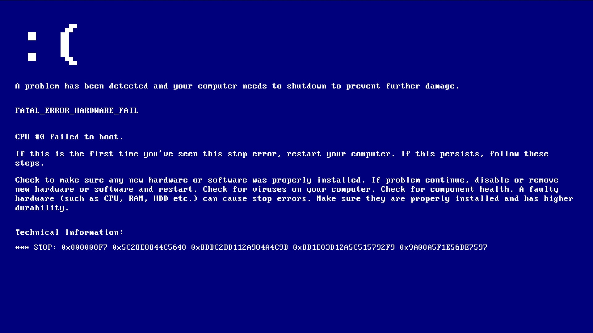

A straightforward OS/terminal simulation with fundamental system capabilities (resembling Linux).

This project is part of a college assignment.
Running this code as is isn't recommended. This version is stable and covers essential functionalities,
but it should be further expanded. No external libraries were utilized, which results in some limitations
in the program's features. One notable omission in this codebase is the absence of multithreading capabilities
(easily implementable, see my [Multithread](https://github.com/saeedkhatami/MultiThread)).

The program itself can perform a variety of fundamental tasks. When you run it, you can see a list of available functions by typing `help`. All functions are currently stored in the _User_cmd.hpp_ file and organized within a namespace. This structure makes it easy to declare and define new functions. A nifty feature you can add is having the program automatically recognize mathematical expressions and output the answers!

Source: <a href="https://github.com/saeedkhatami/OS-Sim">saeedkhatami/OS-Sim</a>
