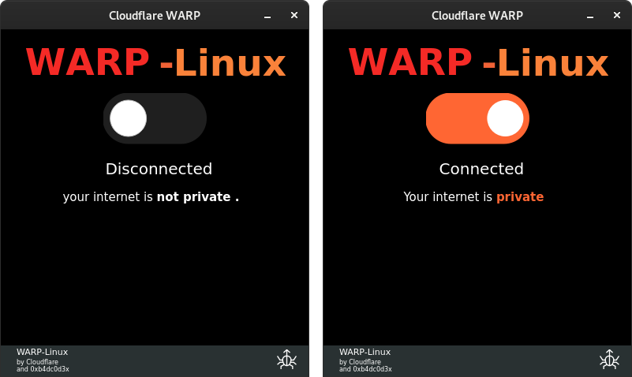
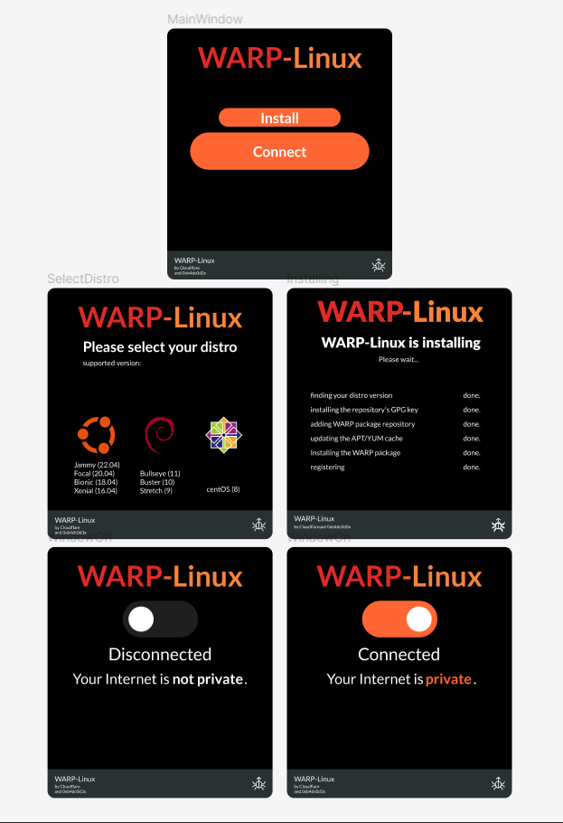

A GUI app base on [warp](https://developers.cloudflare.com/warp-client/get-started/linux) on Windows for linux users.

## Installation

Read [warp-cli install doc](https://developers.cloudflare.com/warp-client/get-started/linux). install `warp-cli` and
register with `warp-cli register`.

and then:

```bash
git clone https://github.com/0xb4dc0d3x/WarpLinuxConnector
cd WarpLinuxConnector
python3 install.py
sudo chmod +x ~/.local/share/applications/WARP-Linux.desktop
```

now search for `WARP-Linux` app in your desktop menu.

> NOTE: After the installation please make sure you do not remove the repository dir. It is required for the desktop shortcut to work.

## Uninstall

Just remove `~/.local/share/applications/warp-gui.desktop` file.

## TODO

- [ ] Change the project from python to c++
- [ ] Add auto installation



Source: <a href="https://github.com/saeedkhatami/RandomPoem">saeedkhatami/RandomPoem</a>
